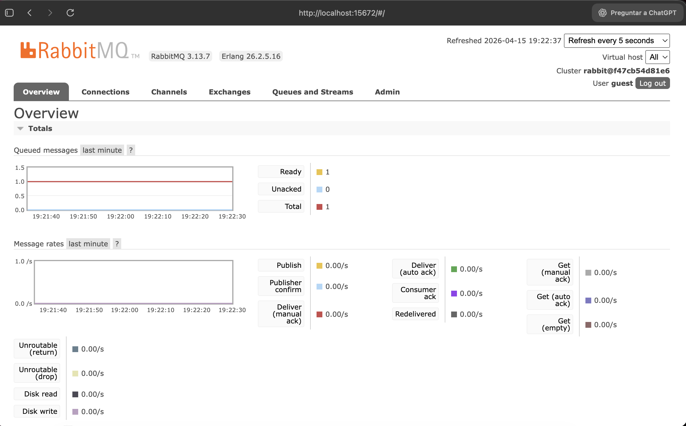
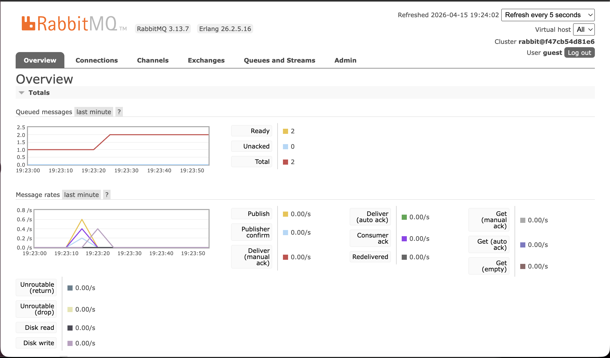
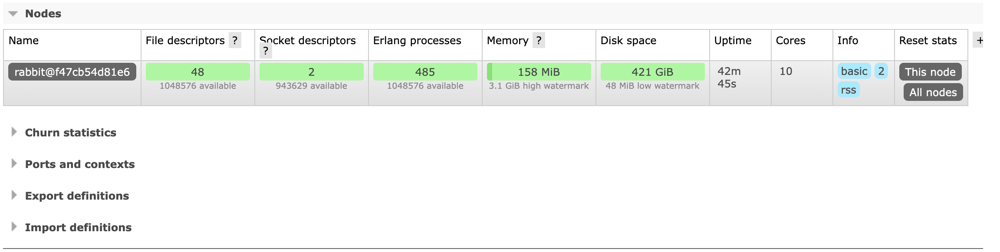
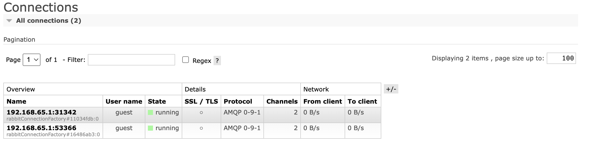

# Connect Microservices to Database

## Activity Overview
This activity connects two Spring Boot microservices to an Oracle Database running in Docker:

- `evaluator-service`
- `gap-detector-service`

The work completed for this activity included:

- configuring both microservices to connect to the same Oracle instance
- creating the Oracle schema, sequences, foreign keys, and indexes
- loading seed data for local testing
- starting both services with the `dev` profile
- validating the main REST endpoints
- enabling RabbitMQ in the local environment and validating the event-driven flow used by the current repository configuration

## Repository Location
The project used in this activity is located at:

```bash
TutorBot/tutorbot-campus
```

## Prerequisites

- Java 21
- Maven 3.9+
- Docker
- Oracle Docker image: `gvenzl/oracle-xe:21-slim`
- RabbitMQ Docker image: `rabbitmq:3.13-management`
- Postman or `curl` for endpoint validation

## Current Local Configuration
The `dev` profile is already configured in both services:

- `TutorBot/tutorbot-campus/backend/evaluator-service/src/main/resources/application-dev.properties`
- `TutorBot/tutorbot-campus/backend/gap-detector-service/src/main/resources/application-dev.properties`

Current values:

```properties
spring.datasource.url=jdbc:oracle:thin:@localhost:1522/XEPDB1
spring.datasource.username=tutorbot
spring.datasource.password=tutorbot123

tutorbot.messaging.enabled=true
spring.rabbitmq.host=localhost
spring.rabbitmq.port=5672
```

If you change the Oracle credentials, you must update both files.

## How to Run the Project

### 1. Go to the project directory

```bash
cd TutorBot/tutorbot-campus
```

### 2. Start Oracle Database

Use this exact command:

```bash
docker run -d \
  --name oracledb \
  -p 1522:1521 \
  -e ORACLE_PASSWORD=password \
  -e APP_USER=tutorbot \
  -e APP_USER_PASSWORD=tutorbot123 \
  gvenzl/oracle-xe:21-slim
```

Wait until the container is ready:

```bash
docker logs -f oracledb
```

You should see:

```text
DATABASE IS READY TO USE!
```

### 3. Create the Oracle schema

```bash
docker cp infrastructure/oracle/V1__init_schema.sql oracledb:/tmp/init.sql

docker exec -e NLS_LANG=AMERICAN_AMERICA.AL32UTF8 oracledb \
  bash -lc "sqlplus -L -s tutorbot/tutorbot123@//localhost:1521/XEPDB1 @/tmp/init.sql"
```

### 4. Load seed data

```bash
docker cp infrastructure/oracle/V2__seed_data.sql oracledb:/tmp/V2.sql

docker exec -e NLS_LANG=AMERICAN_AMERICA.AL32UTF8 oracledb \
  bash -lc "sqlplus -L -s tutorbot/tutorbot123@//localhost:1521/XEPDB1 @/tmp/V2.sql"
```

Expected counts after the seed:

```text
COURSES      6
TOPICS       20
SUBTOPICS    50
EVALUATIONS  300
GAPS         200
```

### 5. Start RabbitMQ

RabbitMQ is required for the current local configuration because messaging is enabled in both `application-dev.properties` files.

```bash
docker run -d \
  --name tutorbot-rabbitmq \
  -p 5672:5672 \
  -p 15672:15672 \
  rabbitmq:3.13-management
```

RabbitMQ Management UI:

- URL: `http://localhost:15672`
- Username: `guest`
- Password: `guest`

### 6. Start `evaluator-service`

Open a new terminal:

```bash
cd TutorBot/tutorbot-campus/backend/evaluator-service
mvn spring-boot:run -Dmaven.test.skip=true -Dspring-boot.run.profiles=dev
```

### 7. Start `gap-detector-service`

Open another terminal:

```bash
cd TutorBot/tutorbot-campus/backend/gap-detector-service
mvn spring-boot:run -Dmaven.test.skip=true -Dspring-boot.run.profiles=dev
```

### 8. Confirm successful startup

You should see these signals in the logs:

- `Oracle connection verified successfully`
- `Tomcat started on port 8082` for `evaluator-service`
- `Tomcat started on port 8084` for `gap-detector-service`
- `Created new connection ... amqp://guest@127.0.0.1:5672/` when RabbitMQ is enabled

## Important Execution Note
In this repository, `mvn spring-boot:run` attempted to compile test sources that currently fail. For the validated local execution, the services were started with:

```bash
-Dmaven.test.skip=true
```

This was used only to run the services locally without modifying the existing test files.

## API Validation

### Evaluator Service

```bash
curl -s http://localhost:8082/api/v1/evaluations | jq 'length'
curl -s http://localhost:8082/api/v1/evaluations/student/A00835003 | jq 'length'
curl -s -w '\nHTTP_STATUS:%{http_code}\n' http://localhost:8082/api/v1/evaluations/99999
```

Expected results:

- all evaluations: `300`
- student `A00835003`: `20`
- `99999`: `404`

### Gap Detector Service

```bash
curl -s http://localhost:8084/api/v1/gaps | jq 'length'
curl -s http://localhost:8084/api/v1/gaps/student/A00835001 | jq 'length'
curl -s http://localhost:8084/api/v1/gaps/student/A00835001/unresolved | jq 'length'
curl -s -w '\nHTTP_STATUS:%{http_code}\n' http://localhost:8084/api/v1/gaps/99999
```

Expected results:

- all gaps: `200`
- student `A00835001`: `14`
- unresolved gaps for `A00835001`: `14`
- `99999`: `404`

## Optional RabbitMQ Validation

The current local setup was also validated with RabbitMQ.

Queues created automatically:

- `student.answered`
- `evaluation.completed`
- `gap.detected`

You can validate the queues from the RabbitMQ API:

```bash
curl -s -u guest:guest http://localhost:15672/api/queues | jq '[.[].name]'
```

During the validated run, publishing a `student.answered` event generated:

- evaluation `301` for student `A00835099`
- gap `201` for student `A00835099`

If Ollama does not have the `llama3` model available, the project still reaches the persistence flow using its fallback behavior.

## Notes

- After loading only the seed data, evaluation IDs go from `1` to `300`.
- Because of that, `GET /api/v1/evaluations/301` returns `404` until a new evaluation is created.
- Oracle was validated with `localhost:1522` on the host mapped to container port `1521`.

## Evidence









## Authors

- José Emilio Inzunza García | A01644973
- Yael García Morelos | A01352461
- Patricio Blanco Rafols | A01642057
- Arturo Gómez Gómez | A07106692
- Andrés Gallego López | A01645740
